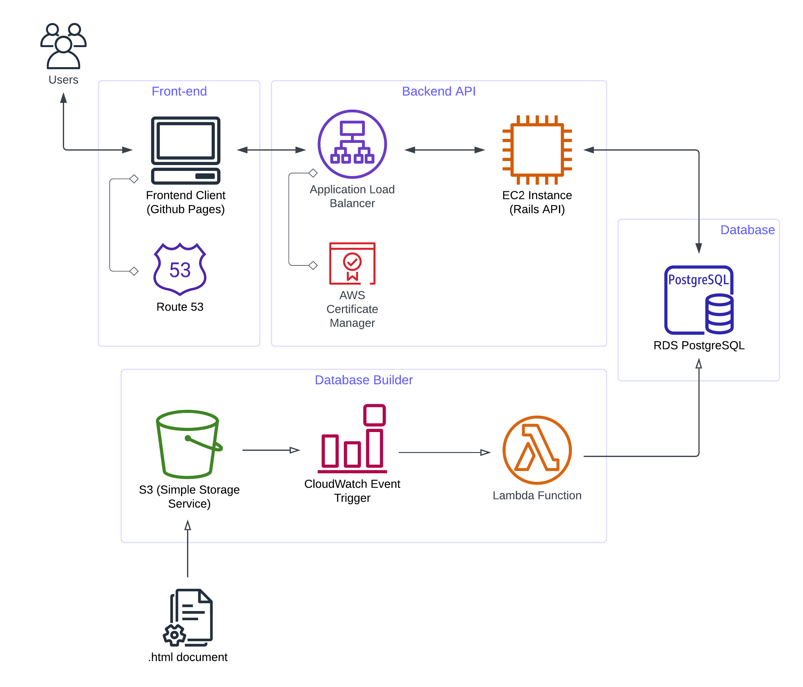
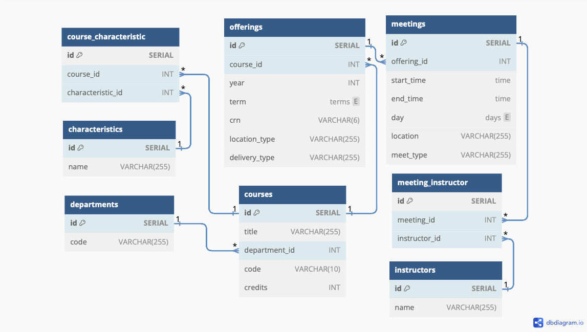

# EMU Course Search
This is an unofficial alternative to EMU's Course Search. The hosted version ([here](https://mohammad4844.github.io/EMU-Course-Search/web_page)) was shut down on 2/2/2024 (because I ran out of free tier :disappointed:).

The main feature here is that you can search courses based on your availabilities. As an example, you can say that your availabilities are: Monday 10am - 3pm, Tuesday 12pm - 6pm, Wednesday 8am - 12pm. It will return only the courses that fall into your availabilty windows. Note that this is not a functionality in EMU's search system.

Along with this, you can also apply other typical features like departments (COSC or WRTG), course levels (100-199 or 400-499), or attributes (Gen Ed Arts, Honors Sections).

## Glossary
- [System Design (AWS)](#system-design)
- [Technolgies Used](#tech-overview)
- [Database Builder](#database-builder)
- [Backend API](#backend-api)
- [Database](#database)
- [Frontend](#frontend)
- [Technical Problems I Faced](#technical-problems-i-faced)

## System Design
Here's a brief overview of the overall system:

## Tech Overview

This is a full-stack web application. The following is an overview of the technolgies used in each part of the project. This app was built using multiple AWS services (Lambda, RDS, Route 53), Ruby on Rails, PostgreSQL and much more.

Database Builder
- AWS: Lambda, S3, Cloudwatch Event Triggers
- Tehcnologies: Python, SQL

Backend API
- AWS: EC2, Load Balancer, Amazon Certificate Manager
- Tehcnologies: Ruby on Rails, Ruby

Database: PostgreSQL
- AWS: RDS (Relational Database Service) for Postgres
- Tehcnologies: PostgreSQL

Frontend: 
- AWS: Route 53
- Tehcnologies: HTML, CSS, JavaScript, Bootstrap

### Database Builder
Preprocess the .html file of course offerings and uses them to build a relational database (Postgres). 
- File is uploaded to the S3 container
- A Cloudwatch Event is triggered
- A call to the Lambda function is made, which processes the html doc to build the database.
- For details on database builder, see [database_preprocess](database_preprocess)

### Backend API
A RESTful API that returns course offerings in json format based on api request filters.
- Built using the Ruby on Rails framework
- Hosted on an EC2 instance
- Fronted by an Application Load Balancer
- Secured with SSL certificate form AWS Certificate Manager, allowing https
- For details on rails api, see the `course_search` submodule

### Database
A Relational database that stores the course offerings for use by the api.
- Uses Amazon RDS for PostgreSQL
- The Database Schema:

### Frontend
A static webpage that interacts with the backend api to show course search results.
- Interacts with api through domain on Route 53
- Static webpage that uses Bootstrap for styling
- Hosted on Github Pages
- For details on frontend, see [web_page](web_page)

## Technical Problems I Faced
- Backend API: writing the search query itself (filtering based on availabilities).
  - The logic when trying to match the right availabilities is very non-intuitive. Among other things, it involves 2 complex grouping queries followed by a manual iteration through the results.
  - See the [implementation](https://github.com/Mohammad4844/course_search_webapp/blob/main/app/controllers/search_controller.rb#L58-L88) for yourself.

- Frontend: figuring out how to 'join' time intervals input by the user that overlapped.
  - As an example: a user enters first Monday 9am-1pm, and then Monday 12pm-5pm. In this case we don't want them to be 2 intervals, but rather one joined interval that is: Monday 9am-5pm.
  - The key factor here was keeping this time & space efficienct since this had to be computed on the user's end and the the naive approach is computationally very expensive.
  - By using some smart filtering beforehand, I ended up with a nice [implementation](https://github.com/Mohammad4844/EMU-Course-Search/blob/main/web_page/script.js#L76-L133).

- AWS/Hosting: having to support https and lots of issues with CORS.
  - Parts of the solution involved registering a domain, obtaining an ssl certificate and a lot of configuration changes in Rails.
  
- Database: a table named 'attributes' broke everything when the db was loaded in rails.
  - The main issue here was all the time it took to figure out what the problem even was. Since 'attributes' is a keyword (sort of) for rails, it conflicted heavily because i had a table with the same name.
  - I had to re-name the table, along with update code in the db builder
